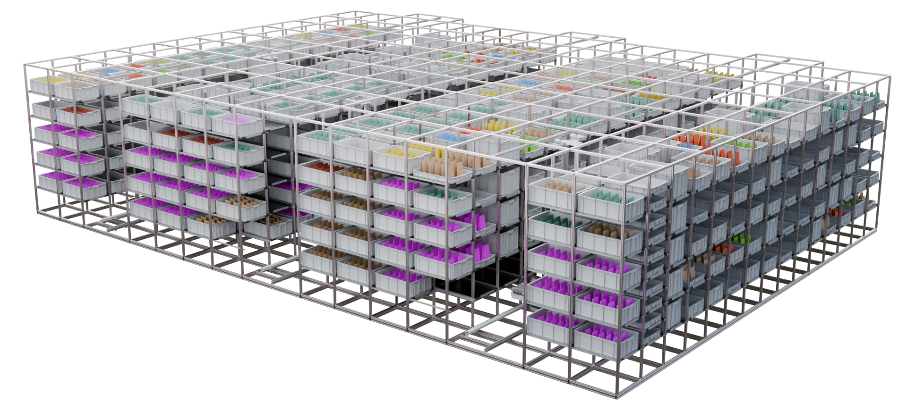

# Platform Overview

### NanoWarehouse Technology

#### Robotic Nano Warehouse platform transforms fulfilment automation

Nano Warehouses are compact fulfilment centers that are positioned close to customers and designed to efficiently manage a moderate volume of daily orders, typically ranging from 1000 to 3000 items per day. The centers are typically of smaller scale, designed with automated infrastructure, and strategically placed in metropolitan areas. They are commonly found in densely populated areas such as tech parks, business centers, townships, and high-density metro localities.

<figure><figcaption></figcaption></figure>
