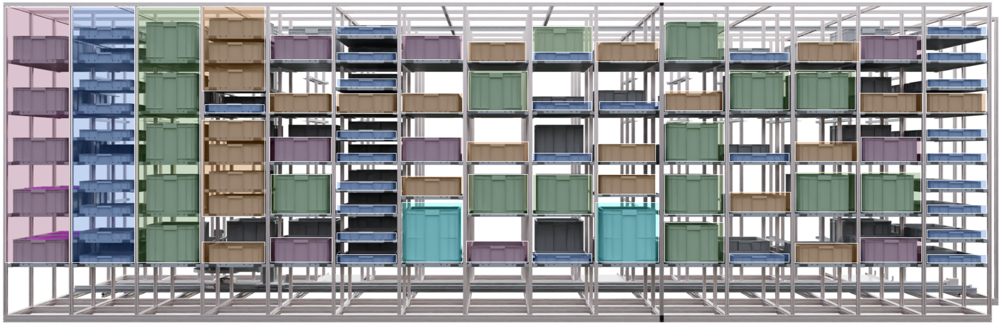

# Flexible Storage Model

Racks offer versatile storage, accommodating bins of various sizes for flexible and adaptable storage solutions. From small bins for organizing small components or large bins for bulkier items, the racks can effortlessly accommodate them all. This ensures the storage space can evolve along with changing requirements, making it a practical choice for environments where versatility is key.

<figure><figcaption></figcaption></figure>
