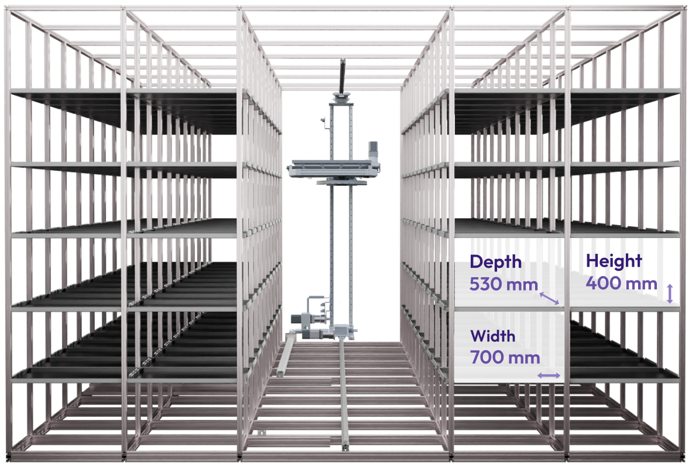

# Racks

Racks are constructed using readily available high-strength aluminium extrusions and can be setup in flexible, high-density layouts for rapid deployment at both new locations and within existing infrastructures. The platform ensures optimal volumetric efficiency via dynamic positioning of totes within double-deep storage shelving.

<figure><figcaption></figcaption></figure>
