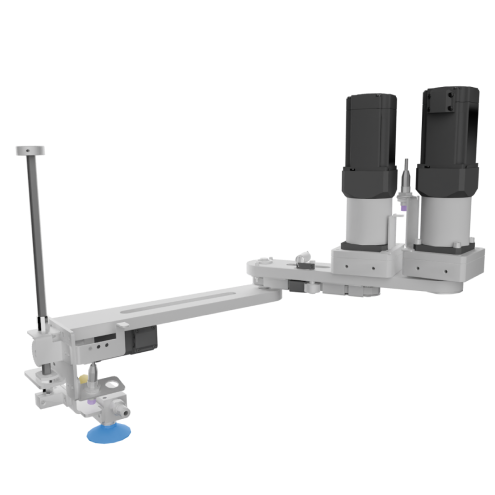

# SCARA Robot

### SCARA

High-Speed Pick and Place for Sorting Applications

SCARA (Selective Compliance Assembly Robot Arm) robots are a popular choice for high-speed pick and place operations, particularly in sorting applications. Their unique design, featuring three axes of motion (two rotational and one vertical), makes them ideal for handling objects on horizontal surfaces with exceptional speed and precision. Our SCARA is equipped with a modular attachment, allowing different Grippers to be used for various operations

#### SCARA robots excel in a variety of sorting applications, including:

**PART FEELING :** SCARA robots can rapidly pick parts from a feeder bowl or tray and place them in a specific orientation for further processing.

**COLLATING :** SCARA robots can collect and assemble multiple components into a single unit, ensuring consistent product quality.

**SINGULATION :** By separating and orienting objects, SCARA robots can ensure that parts are presented in a specific way for downstream processes.

**INSPECTION :** SCARA robots can precisely position parts for visual or automated.

<figure><figcaption></figcaption></figure>
