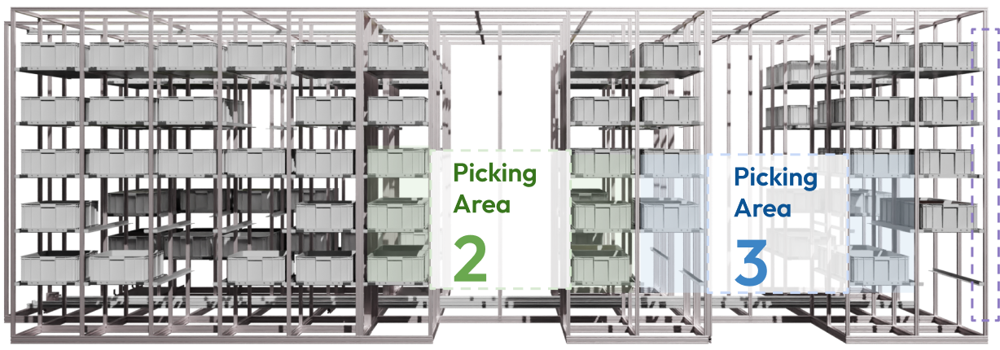

# Direct Pickup Station

Dynamic in-rack pickup locations are spported to allow for maximum flexibility and faster operations, especially at peak loads. The software and indicator systems support picking of multiple orders concurrently, separate order picking, or even whole case picking.

<figure><figcaption></figcaption></figure>
