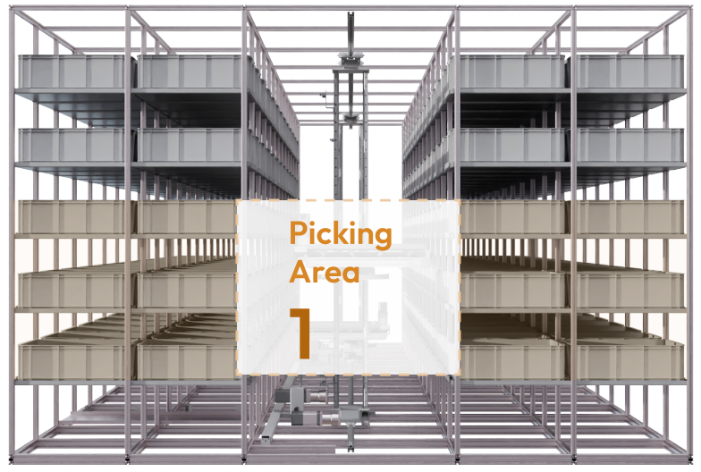

# Flexible Pickup Station

Flexibility of the racking design allows nearly ad-hoc preripheral tote locations to be designated as direct pickup locations. This facilitates efficient decanting, sorting, picking, consolidation, audit, and dispatch operations.

<figure><figcaption></figcaption></figure>
