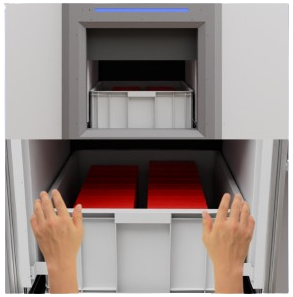

# Secure Pickup Station

Secure kiosk-style picking and drop-off stations. The station is fully enclosed, allowing parcel access only post-authentification via QR/BARcodes or other authentication methods. Upon authentication, the station sliding door opens to grant users access to pickup items or drop new items. Post pickup or drop-off, the item’s weight, height, and image are recorded and verified. The station is equipped with safety curtains to ensure unobstructed door movement and hand safety.

<figure><figcaption></figcaption></figure>
