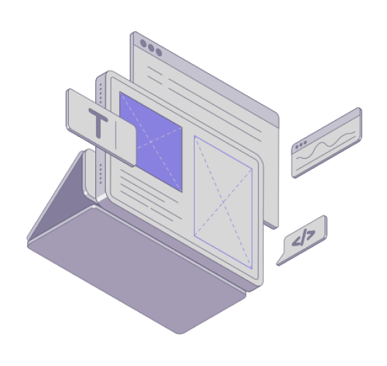

# Orchestration Software

The central orchestration software manages in real-time the flow of goods and coordinates movements of shuttles and conveyors for accessing precise and ensuring up-to-date information on all components, orders, and inventory are tracked, and overall warehouse operations are fully monitored in detail.

<figure><figcaption></figcaption></figure>
