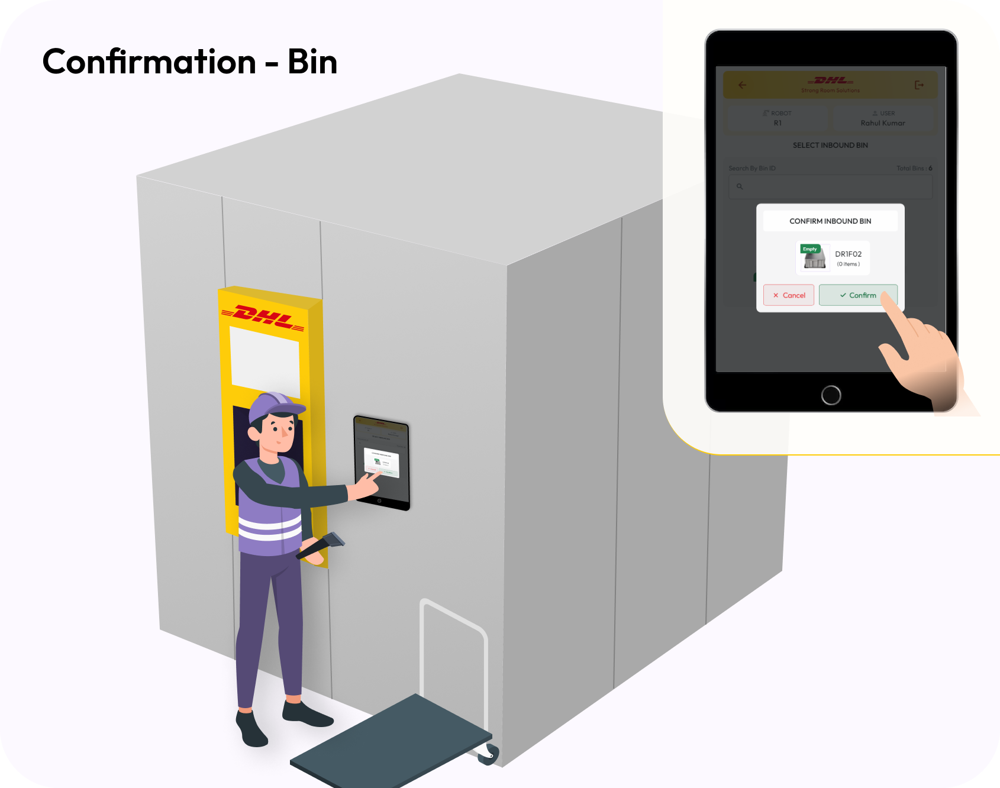

# Managing Inbound and Outbound Flows

### Login Process:

* Scan the QR code for authentication using the scanner.

<figure><figcaption></figcaption></figure>

* Choose either Inbound or Pickup (Outbound).

<figure><figcaption></figcaption></figure>

### **Inbound Process:**

* Select the required bin and confirm.

<figure><figcaption></figcaption></figure>

<figure><figcaption></figcaption></figure>

* Once the bin is retrieved, scan the Part ID and place the item into the bin. If there are\
  multiple items with the same Part ID, scan each one separately

<figure><figcaption></figcaption></figure>

<figure><figcaption></figcaption></figure>

* Tap Complete Order.

<figure><figcaption></figcaption></figure>

* To process another order, tap Continue, or select Logout to exit.

<figure><figcaption></figcaption></figure>

<figure><figcaption></figcaption></figure>

### **Outbound Goods Process:**

* Select and confirm the bin from the pick list.

<figure><figcaption></figcaption></figure>

<figure><figcaption></figcaption></figure>

* Once the bin is retrieved, pick the product and scan the Part Number. If multiple items\
  have the same Part Number, scan each separately.

<figure><figcaption></figcaption></figure>

<figure><figcaption></figcaption></figure>

* Tap Complete Order.

<figure><figcaption></figcaption></figure>

* To process another order, tap Continue, or select Logout to exit.

<figure><figcaption></figcaption></figure>

<figure><figcaption></figcaption></figure>

### Key Performance Indicators (KPIs):

* **Cycle Time**: The time taken to complete an order from inbound to outbound.
* **Pick Accuracy**: Percentage of correctly picked orders.
* **Order Fulfilment Rate**: Percentage of orders completed within the required timeframe.

### Hands-On Training:

* Operators should complete several practice cycles of inbound and outbound processes using both a simulator and live systems to reinforce learning.
