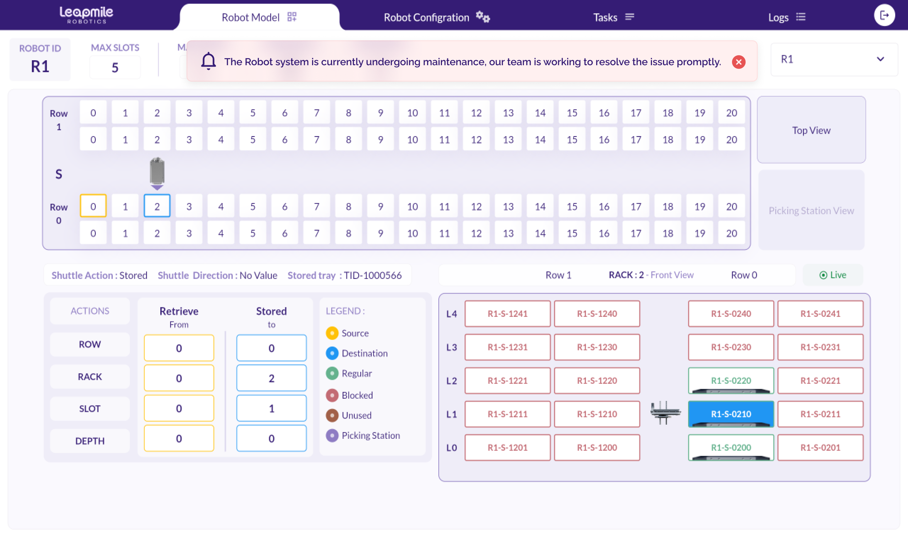
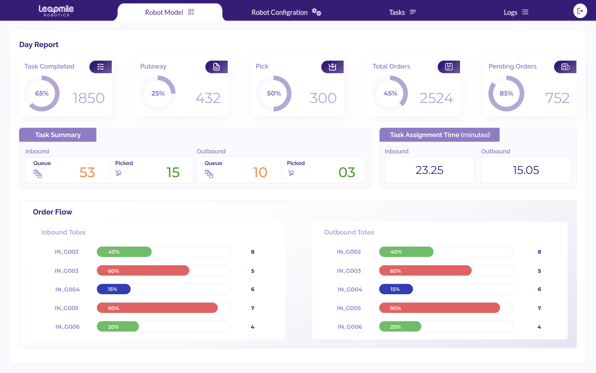

# Monitoring and Assessing Performance

### Key Features of the Dashboard:

* **Real-Time System Status**: Current status of shuttles, conveyors, and pickers.

<figure><figcaption></figcaption></figure>

* **Order Progress**: Active tasks, expected delivery times, and status of orders.

<figure><figcaption></figcaption></figure>

* **Inventory Levels**: Real-time updates of item locations within the system.

<figure><figcaption></figcaption></figure>

* **Alerts and Notifications**: System alerts for maintenance or operational issues.

<figure><figcaption></figcaption></figure>

### KPIs to Monitor:

* **Operator Efficiency**: Time spent per task, pick rate, and error rates.

<figure><figcaption></figcaption></figure>

* **System Utilization**: Percentage of time that the system hardware (shuttles, conveyors, etc.) is actively being used.

<figure><figcaption></figcaption></figure>
