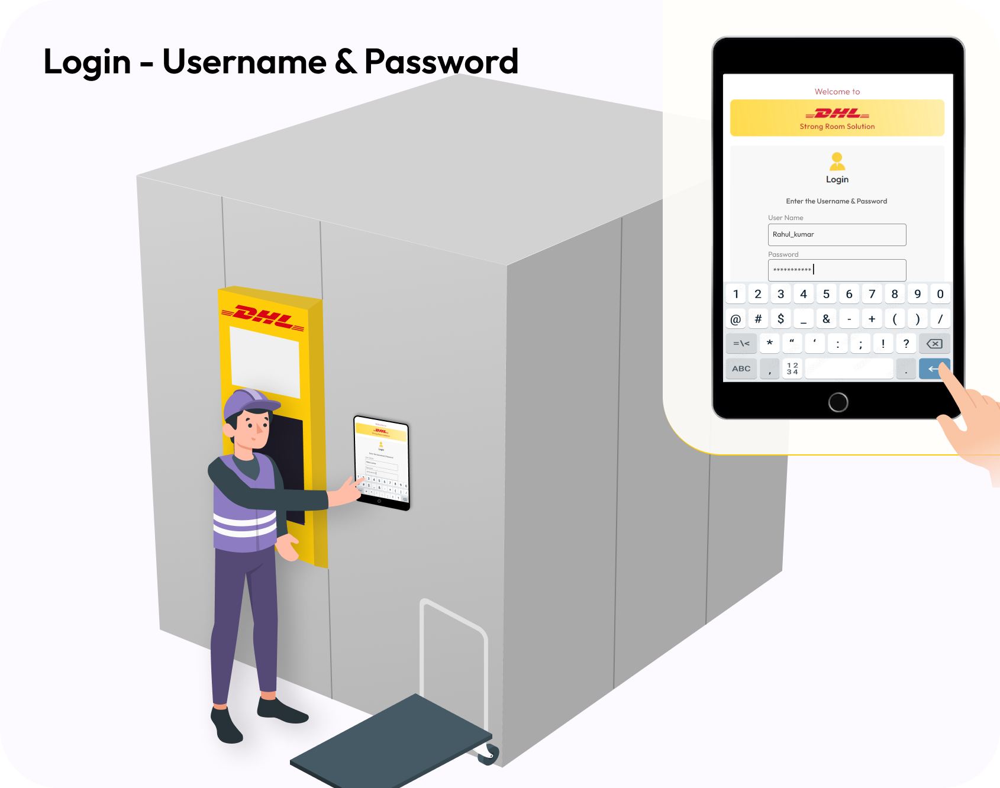
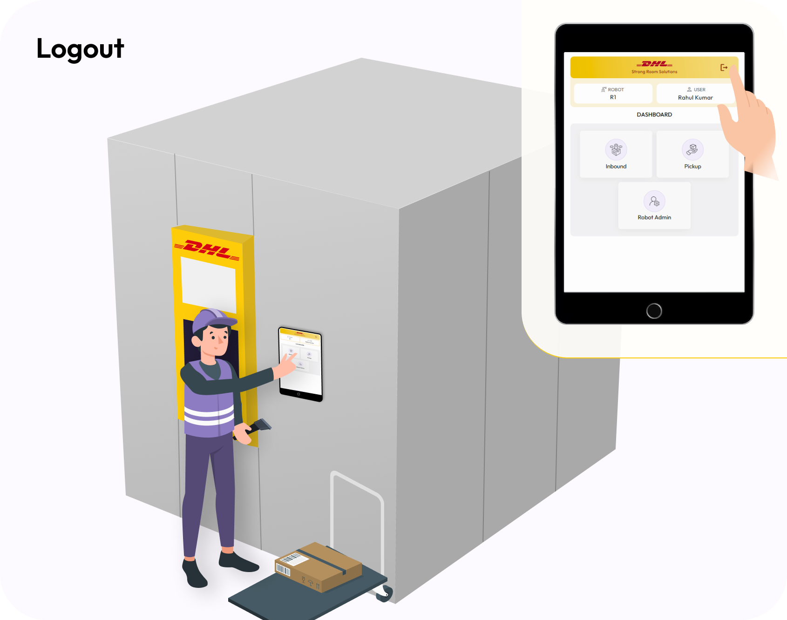
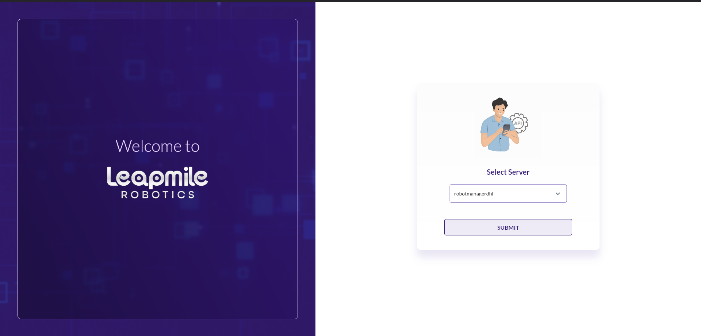
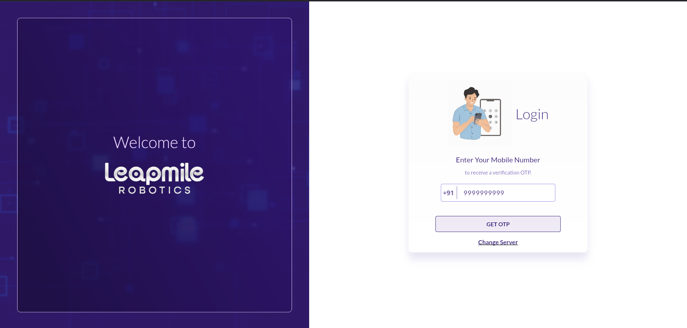
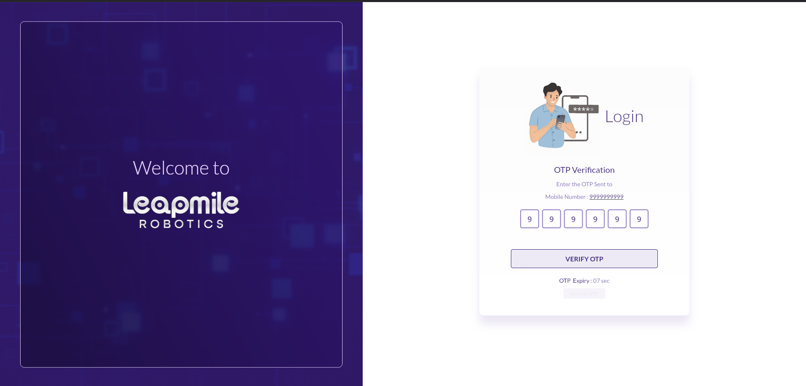

# System Authentication

* **Login Credentials**: Ensuring secure and authorized access to the system. Enter username and password/OTP or ID card access. Ensuring the correct role is selected to avoid unauthorized actions. The importance of logging out after use to maintain system security.

<figure><figcaption></figcaption></figure>

<figure><figcaption></figcaption></figure>

<figure><figcaption></figcaption></figure>

<figure><figcaption></figcaption></figure>

<figure><figcaption></figcaption></figure>

* **Role-Based Access**: Depending on the user role (e.g., operator, supervisor, admin), the dashboard and available functions will differ.

<figure><figcaption></figcaption></figure>

<figure><figcaption></figcaption></figure>

<figure><figcaption></figcaption></figure>

* **System Overview**: After logging in, familiarize with the main console and dashboard, which include key information such as system status, active tasks, and inventory data.

<figure><figcaption></figcaption></figure>

<figure><figcaption></figcaption></figure>
