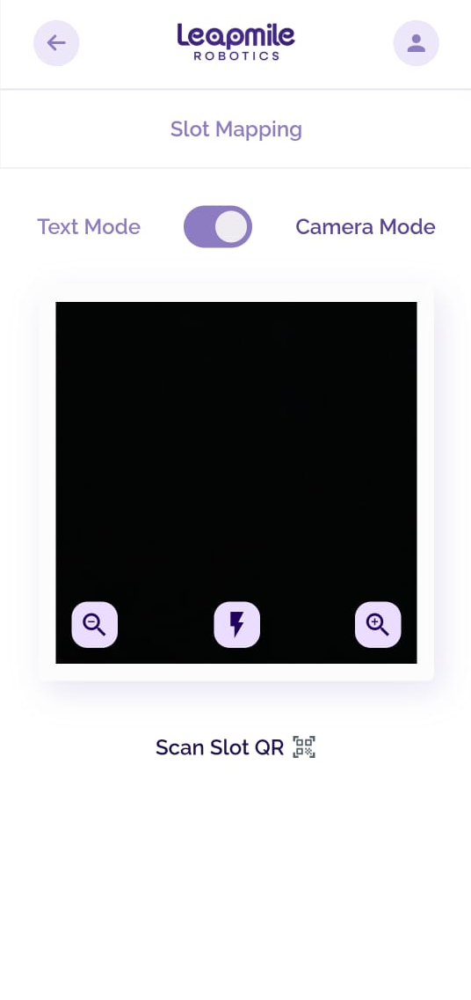

# User Training by Role

**Software Architecture**: Overview of the software and its interaction with WMS, ERP, and other systems.

**Custom Workflows**

* To optimize workflows in storage operations, focus on inbound and outbound processes. For inbound, start by selecting a bin, scanning the product QR code to place items in the bin, and marking the order as complete. In outbound, call the designated bin, scan the product QR code, retrieve the item, and finalize the order. Use FIFO (First In, First Out) for perishable items to prioritize older stock and LIFO (Last In, First Out) for durable goods to streamline handling. Integrate automated tools for bin selection and QR scanning to enhance accuracy and efficiency in both processes.
* [Click here](managing-inbound-and-outbound-flows.md) to view the workflow.

**System Configuration**

* Managing consoles, bins, rack configurations, and shuttles.

<figure><figcaption></figcaption></figure>

<figure><figcaption></figcaption></figure>

* Setting up user roles, permissions, and access control.

<figure><figcaption></figcaption></figure>

<figure><figcaption></figcaption></figure>

* Adjusting performance thresholds for KPIs.
